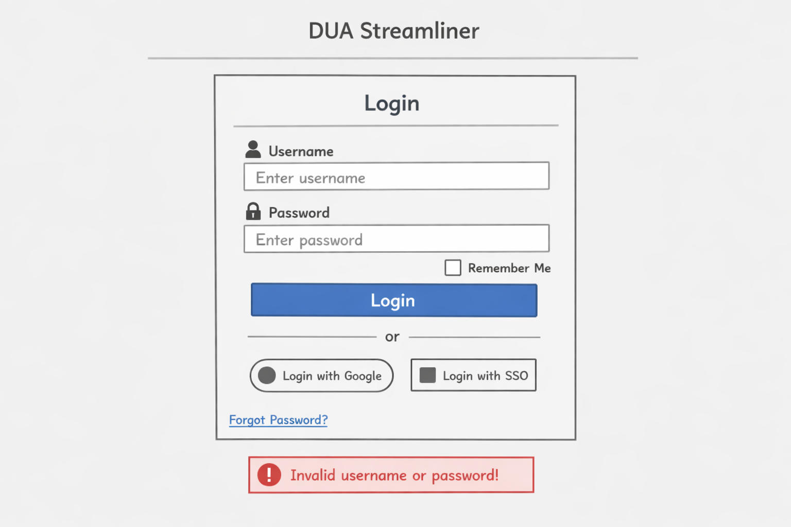
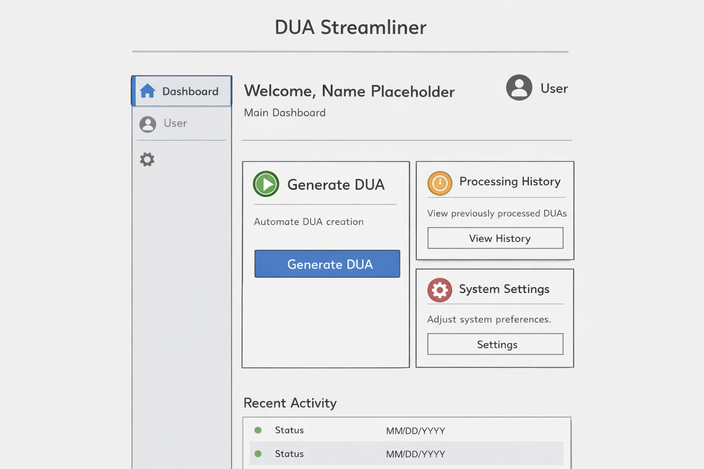
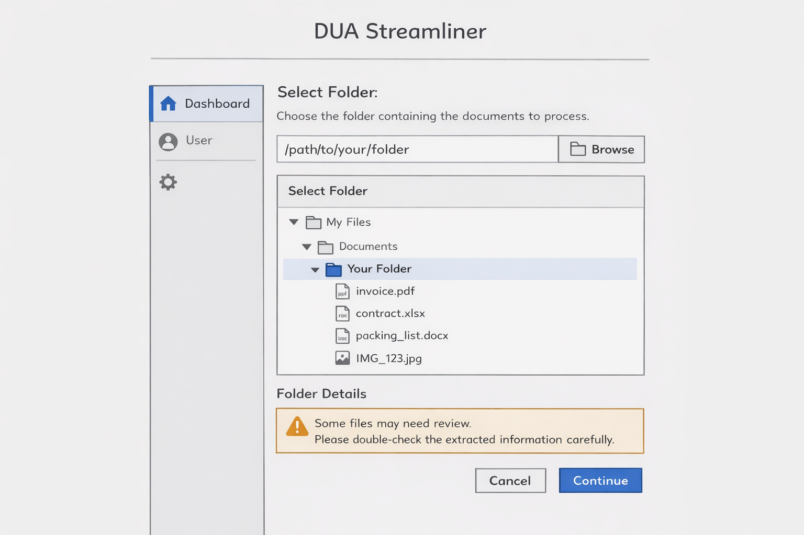
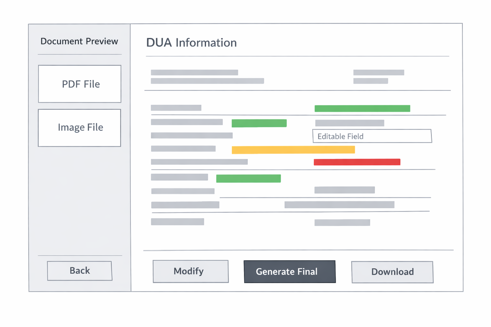
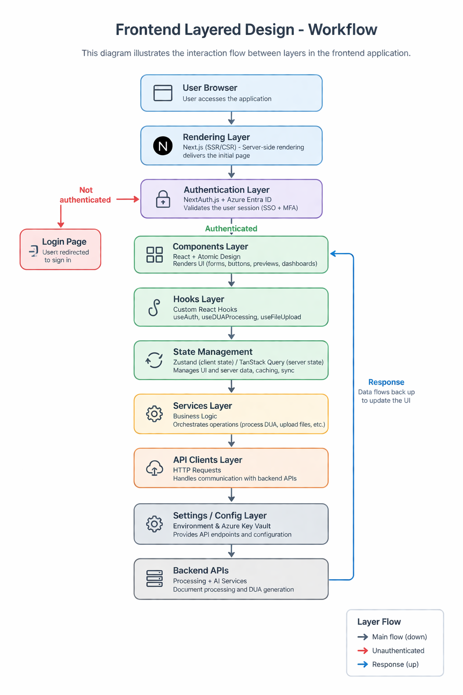

# 1. Frontend Desing

## 1.1 Technology Stack
- **Application Type:** Server-Side Rendering (SSR) Web App + Client-side interactivity
- **Web framework:** Next.js version 15.x
- **UI Library:** React version 19.x
- **Language:** TypeScript 5.9.x
- **Component Library:** Material UI 6.x
- **Styling:** Tailwind CSS 4.x
- **State management:** Zustand 5.x
- **Data fetching:** TanStack Query 5.x
- **Forms:** React Hook Form 7.x
- **Validation:** Zod 4.x
- **File upload:** React Dropzone 14.x
- **Document preview:**
    - PDF viewer: react-pdf
    - Image preview: native browser APIs
- **Unit testing:** Jest 30.x
- **Component testing:** React Testing Library 15.x
- **E2E testing:** Playwright 1.58.x
- **Authentication:** OAuth 2.0 / OpenID Connect
    - Library: NextAuth.js 5.x
- **Linter:** ESLint 10.x
- **Formatter:** Prettier 3.x
- **Git hooks:** Husky 9.x
- **Cloud provider:** Microsoft Azure
- **Frontend hosting:** Azure App Service
- **CI/CD:** Azure DevOps Pipelines
- **Environments:** development / staging / production
- **Monitoring:** Azure Application Insights

## 1.2 UX UI analysis

### Core Business Process

#### 1. User Authentication
- The user enters their username and password on the login screen.
- The system validates the credentials and grants access to the main dashboard upon successful authentication.
- If authentication fails, the system displays an error message.

#### 2. Action Selection
- The user initiates a new DUA generation process by clicking the “Generate DUA” button.
- The system navigates to the document input interface.

#### 3. Document Source Selection
- The user selects or uploads a folder containing the required documents.
- The system validates the folder contents and checks for supported file formats.

#### 4. Document Processing
- The user starts the document processing operation.
- The system performs:
    - Reading structured files (Excel and Word).
    - Extracting text from PDF documents.
    - Optical Character Recognition (OCR) on scanned images.
- The system displays a processing status indicator (e.g., progress bar or loading state)

#### 5. Preliminary DUA Generation
- The system generates a preliminary DUA document using the extracted data.
- The document is displayed with visual confidence indicators:
    - Green: High confidence
    - Yellow: Medium confidence
    - Red: Requires review

#### 6. Review and Correction
- The user reviews the generated DUA fields.
- The user can manually edit incorrect or incomplete information.
- The system may highlight inconsistencies or missing required fields.

#### 7. Final DUA Generation
- The user confirms the final generation of the DUA.
- The system validates all required fields before proceeding.
- The system generates the final document using the official template.

#### 8. Document Export
- The user requests to download the generated document.
- The system provides available download options (e.g., Word format).
- The document is downloaded to the user’s device

#### 9. Session Continuation or Logout
- The user may:
    - Start a new DUA generation process, or
    - Log out of the system.


### Wireframes
#### Login


#### Main Page


#### Select Folder


#### Document Preview


### UX Test Results


## 1.3 Component Design Strategy

### Design Approach
The frontend component design follows the Atomic Design methodology, enabling the construction of complex interfaces from small, reusable building blocks.

- Atoms: Basic UI elements (buttons, inputs, labels, icons)
- Molecules: Groups of atoms (form fields, input groups, file selectors)
- Organisms: Complex UI sections (navigation sidebar, document preview panel, DUA form sections)
- Templates / Pages: Full layouts (dashboard, document processing flow, DUA preview page)

### Component Reusability Strategy
- Component modularization using React functional components
Separation of:
    - UI logic (presentation components)
    - Business logic (custom hooks)
- Creation of shared components, such as: Buttons, Input fields, Status indicators, File upload components.
- Use of props and composition patterns to make components flexible and configurable

### State and Logic Encapsulation
- Local UI state is handled with Zustand
- Server state and asynchronous data are handled with TanStack Query
- Custom hooks are used to encapsulate logic (e.g., useDUAProcessing, useFileUpload)

### Styling Strategy and Centralization
- Component-level styling:
    - Each component has its own styling file or configuration
- Technologies used:
    - Material UI for base components and design system
    - Tailwind CSS for layout and spacing utilities
- Styling rules:
    - Material UI → UI components (buttons, inputs, dialogs)
    - Tailwind → layout (grid, spacing, responsiveness)
- Naming conventions:
    - CSS class pattern: ComponentName-element-modifier
- Use of theme configuration (MUI Theme) to centralize:
    - Colors (including confidence indicators)
    - Typography
    - Spacing scale

### Internationalization (i18n)
- Language switching is not supported for this project

### Responsiveness Strategy
- Tailwind CSS responsive utilities (breakpoints)
- Material UI responsive components and grid system

- Design principles:

    - Mobile-first approach
    - Flexible layouts using: flex, grid.
- Units: Relative units (rem, %) instead of fixed pixels
- Key UI adaptations:
    - Sidebar collapses on small screens
    - Document preview switches from split view to stacked layout
    - Tables become scrollable

### Accessibility Considerations
- Accessibility is not taken into account in this project.

## 1.4 Security

### Authentication Strategy
- Authentication is handled using:
    - NextAuth.js (v5.x) integrated with Next.js App Router
    - Identity provider: Microsoft Azure via Azure Entra ID (formerly Azure Active Directory)
- Supported mechanisms:
    - Single Sign-On (SSO) via Azure Entra ID
    - OAuth 2.0 / OpenID Connect (OIDC) flows
    - Multi-Factor Authentication (MFA) enforced by Azure Entra ID

### Session Management
- Session handling is managed by NextAuth.js using:
    - JWT-based sessions
    - Secure HTTP-only cookies
- Cookies configured with:
    - HttpOnly
    - Secure
    - SameSite=Strict
- Session expiration and refresh handled automatically

### Authorization Strategy (RBAC)

Authorization is implemented using a Role-Based Access Control (RBAC) model.

- Defined Roles
    - Manager
    - Customs Agent
- Permissions by Role
    - **Manager:**
        - Permission Code: `MANAGE_USERS`
            - Description: Manage user accounts (CRUD operations)
        - Permission Code: `VIEW_REPORTS`
            - Description: Access operational and system reports
        - Permission Code: `EDIT_TEMPLATES`
            - Description: Modify DUA templates and system configurations
    - **Customs Agent**
        - Permission Code: `UPLOAD_FILES`
            - Description: Upload and manage document folders
        - Permission Code: `PROCESS_DOCUMENTS`
            - Description: Trigger document processing and AI extraction
        - Permission Code: `REVIEW_DUA`
            - Description: Review and edit generated DUA data
        - Permission Code: `GENERATE_FINAL_DUA`
            - Description: Confirm and generate final DUA document
        - Permission Code: `DOWNLOAD_DUA`
            - Description: Download generated DUA files

### Secure Storage of Secrets
Sensitive configuration and secrets are managed using:
- Microsoft Azure Key Vault

Stored data includes:
- API keys
- Environment variables
- Authentication secrets
- External service credentials

### Frontend Security Best Practices
The frontend implements the following protections:
- Input validation using Zod
- Sanitization of user inputs to prevent injection attacks
- CSRF protection via NextAuth built-in mechanisms
- Secure API communication over HTTPS only
- Content Security Policy (CSP) headers (configured in Next.js)

### File Upload Security
ImplementsSince the system handles document uploads:
- File type validation (PDF, DOCX, XLSX, images only)
- File size limits enforced
- Files are not executed, only processed
- Server-side validation required before processing

### Project Structure (Security Components Location)
```
/src
 ├── /auth
 │    ├── auth.config.ts        # NextAuth configuration
 │    ├── auth.provider.tsx     # Session provider
 │
 ├── /hooks
 │    ├── useAuth.ts
 │    ├── usePermissions.ts
 │
 ├── /middleware
 │    ├── authMiddleware.ts     # Route protection
 │
 ├── /lib
 │    ├── permissions.ts        # Role & permission definitions
 │
 ├── /services
 │    ├── authService.ts        # Authentication logic abstraction
 ```


## 1.5 Layered Design



### Rendering Layer (SSR + Client-Side Rendering)
- Server-Side Rendering (SSR) for initial page load
- Client-side rendering for interactive components

Flow:

- When a user accesses the application:
    - The server renders the initial view
    - Client-side hydration enables interactivity

- If no authenticated session is detected:
    - The request is redirected to the Authentication Layer

### Authentication Layer
Responsibilities:
- Validate user session on each request
- Handle login via Azure Entra ID (SSO + MFA)
- Protect routes using middleware

If authentication is successful:
- The user is allowed to access protected resources
- The request proceeds to the Components Layer

### Components Layer (UI Layer)
This layer is responsible for rendering the user interface.
- Built using React components
- Structured using Atomic Design methodology:

Responsibilities:
- Render UI elements
- Display DUA preview with confidence indicators
- Handle user interactions

### Hooks Layer (Logic Binding Layer)
Implemented using custom React hooks

Examples:
- `useAuth()` → session and user data
- `useDUAProcessing()` → handles document processing flow
- `useFileUpload()` → manages file selection and upload

Responsibilities:
- Encapsulate reusable logic
- Manage interaction between UI and services
- Keep components clean and declarative

### State Management Layer
State is divided into:
- Client State:
    - Managed with Zustand
    - Stores: UI state, Temporary user interactions

- Server State:
    - Managed with TanStack Query
    - Handles: API data fetching, Caching, Background updates

### Services Layer (Business Logic Layer)
Responsibilities:
- Orchestrate frontend operations such as:
    - Triggering document processing
    - Requesting DUA generation
    - Handling validation workflows
    - Abstract API calls from UI logic

### API Clients Layer
Responsibilities:
- Execute HTTP requests to backend APIs
- Handle request/response transformations
- Manage error handling

### Settings / Configuration Layer
Responsibilities:
- Access environment variables (via Next.js runtime)
- Retrieve API endpoints and configuration values

Sensitive data is stored in:
- Microsoft Azure Key Vault

### Utils Layer
Responsibilities:
- Data formatting (dates, currency, numbers)
- Validation helpers
- File processing helpers


## 1.6 Design Patterns

### Strategy Pattern – Document Processing
Is used to define multiple document processing algorithms and select the appropriate one at runtime based on file type.

### Adapter Pattern – DUA Document Output Formatting
Is used to transform extracted data into the structure required by the final DUA document format (Word template).
- Each adapter converts raw data into a specific representation:
    - Paragraphs
    - Tables
    - Labels
    - Monetary values

### Observer Pattern – UI Updates & Processing Status
The Observer Pattern allows different parts of the application to react automatically to state changes.

- Implemented using:
    - Zustand
    - TanStack Query


# 2. Backend Desing

## 2.1 Technology Stack

- **Application Type:** Architecture Style: Modular Monolith + Asynchronous Processing (Queue-based)
- **API Style:** RESTful API + Background Workers
- **Framework:** NestJS version 11.x
- **Runtime:** Node.js version 22.x (LTS)
- **Language:** TypeScript version 5.9.x
- **API Layer:**
    - **HTTP Server:** Built-in NestJS (Express adapter)
    - **API Documentation:** Swagger (OpenAPI 3.x via NestJS Swagger module)
- **Authentication & Authorization:**
    - **Auth Strategy:** OAuth 2.0 / OpenID Connect (OIDC)
    - **Identity Provider:** Azure Entra ID (same as frontend)
    - **Library:** Passport.js version 0.7.x
    - **JWT Handling:** jsonwebtoken version 9.x
- **Database:** PostgreSQL version 16.x
- **ORM:** Prisma version 6.x
- **Cloud Storage:** Azure Blob Storage
- **SDK:** Azure SDK for JavaScript version 12.x
- **Asynchronous Processing:**
    - **Queue System:** BullMQ version 5.x
    - **Queue Backend:** Redis version 7.x
    - **Worker Processes:** Separate NestJS worker modules

- **Document Processing:**
    - **PDF Parsing:** pdf-parse version 1.1.x
    - **Word (.docx):** mammoth version 1.6.x
    - **Excel (.xlsx):** xlsx version 0.19.x
    - **OCR Engine:** Tesseract.js version 5.x

- **AI / Semantic Extraction:**
    - **AI Integration:** OpenAI API / Azure OpenAI
    - **HTTP Client:** Axios version 1.7.x
- **Word Generation:** docx version 9.x
- **Validation Library:** Zod version 4.x
- **Environment Config:** NestJS Config Module
- **Secrets Management:** Azure Key Vault
- **Testing:**
    - **Unit Testing:** Jest version 30.x
    - **Integration Testing:** NestJS Testing Utilities
    - **E2E Testing:** Supertest version 7.x
- **Logger:** Winston version 3.x
- **Monitoring:** Azure Application Insights
- **Password hashing:** bcrypt version 5.x
- **Security Middleware:** Helmet version 7.x
- **CORS:** NestJS built-in configuration
- **Linter:** ESLint 10.x
- **Formatter:** Prettier 3.x
- **Git Hooks:** Husky 9.x
- **Cloud Provider:** Microsoft Azure
- **Backend Hosting:** Azure App Service / Azure Container Apps
- **Queue Hosting:** Redis (Azure Cache for Redis)
- **CI/CD:** Azure DevOps Pipelines

## 2.2 Security

### Transport Security (HTTPS)
- All communication between client and backend is enforced over HTTPS (TLS 1.3).
- Insecure HTTP requests are automatically redirected to HTTPS.
- TLS certificates are managed via Azure (App Service / Front Door).
#### Policies:
- Minimum TLS version: 1.2 (preferred 1.3)
- Strong cipher suites only (no deprecated algorithms)
- HSTS enabled

### Data Encryption
All external and internal communications use HTTPS (TLS).
- Encryption method:
    - AES-256 (Advanced Encryption Standard)
- Transparent Data Encryption (TDE) at the infrastructure level (Azure-managed)
- Sensitive fields may also be encrypted at application level when necessary
- Encryption for File Storage:
    - Azure Blob Storage:
        - Server-side encryption with AES-256
        - Optional: customer-managed keys via Azure Key Vault

### Authentication & Authorization
- Authentication:
    - OAuth 2.0 / OpenID Connect via Azure Entra ID
- Token type:
    - JWT (signed, short-lived)

#### Token Policies:
- Access token expiration: 15–60 minutes
- Refresh tokens handled via secure flows (frontend-managed)

#### Authorization (RBAC)
Roles:
- Manager
- Customs Agent

Enforced at:
- API level (guards in NestJS)
- Service layer (defense in depth)

### API Protection

#### Payload Size Limits
To prevent abuse and resource exhaustion:

- Global request size limit:
    - 10 MB
- Exceptions:
    - File upload endpoints:
        - Up to 100 MB per request
        - Configurable based on environment

#### Validation:
- File type validation (PDF, DOCX, XLSX, images only)
- MIME type + extension verification
- Server-side validation required before processing

#### Rate Limiting
To prevent DoS and abuse:
- General API rate limit:
    - 100 requests per minute per user/IP
- Stricter limits:
    - Auth endpoints:
        - 20 requests per minute
    - File upload endpoints:
        - 10 requests per minute

#### Implementation:
- NestJS rate limiting middleware
- IP-based + user-based throttling

#### Concurrent Processing Limits
To protect system stability:
- Max concurrent processing jobs per user:
    - 3 active jobs
- Global worker concurrency:
    - Configurable (e.g., 5–10 workers depending on resources)
- Queue-level backpressure using:
    - BullMQ

### Data Retention & Lifecycle Policy

#### Production Data Retention
- Raw uploaded documents:
    - Retained for 30 days
- Generated DUA documents:
    - Retained for 90 days
- Extracted structured data (metadata):
    - Retained for 1 year

#### Archival Strategy
- After retention period:
    - Files are moved to cold storage (Azure Archive Tier)
- After archival period (e.g., 1 year):
    - Data may be:
        - Permanently deleted, or
        - Retained depending on compliance requirements

### Deletion Policy
- Users may request deletion of their data
- Soft delete → followed by scheduled permanent deletion

### Input Validation & Sanitization
- Validation library: Zod
- All incoming data is validated at:
    - Controller level
    - DTO level

#### Protections:
- SQL Injection → prevented by ORM (Prisma)
- XSS → input sanitization
- File-based attacks → strict file validation

### File Upload Security
- Files are:
    - Stored, not executed
    - Scanned before processing
#### Restrictions:
- Allowed formats:
    - PDF, DOCX, XLSX, PNG, JPG
- File size limits enforced
- No direct execution of uploaded content

### Secrets Management
- All secrets stored in:
    - Azure Key Vault

Includes:
- API keys (AI services)
- Database credentials
- JWT secrets
- Storage access keys

### Logging & Monitoring Security
- Logging via Winston + Azure Application Insights

#### Sensitive Data Handling:
- No logging of:
    - Tokens
    - Passwords
    - Full documents
- Logs are:
    - Structured
    - Sanitized

### Availability & Abuse Protection
- Protection against:
    - DoS / DDoS via Azure infrastructure
- Queue system prevents overload:
    - Jobs are buffered instead of crashing system

## 2.3 Observability

### Event Logging
The system logs structured events across key stages of the processing pipeline:

#### Authentication & Access
- User login (success / failure)
- Token validation failures
- Unauthorized access attempts

#### File Management
- Folder upload initiated / completed
- File validation success / failure
- Unsupported file type detection

#### Processing Pipeline (Core Events)
- Job created
- Job started
- Job completed
- Job failed (with error details)
- Per-stage events:
    - Document parsing started/completed
    - OCR started/completed
    - AI extraction started/completed
    - DUA mapping started/completed
    - Document generation completed

#### System & Errors
- Unhandled exceptions
- External service failures (OCR / AI APIs)
- Queue failures / retries
- Timeout events

#### Security Events
- Rate limit exceeded
- Payload size exceeded
- Suspicious activity (multiple failed attempts)

### Logging Platform
- Logging and telemetry are centralized using:
    - Azure Application Insights

#### Features used:
- Structured logs (JSON format)
- Distributed tracing (API ↔ workers)
- Exception tracking
- Dependency monitoring (AI APIs, storage, DB)

#### Log Structure
Each log includes:
- Timestamp
- User ID (if available)
- Job ID
- Event type
- Status (success / failure)
- Error message (if applicable)

### Metrics & Monitoring
Key metrics collected:

#### System Metrics
- API response time
- Error rate (%)
- Throughput (requests/sec)

#### Processing Metrics
- Average job processing time
- Queue length (pending jobs)
- Job success vs failure rate
- Retry count

#### Resource Metrics
- CPU / Memory usage (workers)
- Storage usage (files)

### Dashboards & Visualization
- Dashboard platform:
    - Azure Monitor
    - Integrated with Application Insights

#### Dashboards include:
- Real-time job processing status
- Error rate trends
- Queue health (backlog, delays)
- API performance metrics

### Alerting
Alerts are configured for:
- High error rate (>5%)
- Job failure spikes
- Queue backlog threshold exceeded
- External service failures (AI/OCR unavailable)

Notifications via:
- Email
- Azure alerts system

### Tracing (Distributed Tracing)
- End-to-end tracing enabled:
    - API request → Job creation → Worker processing → Result

Allows:
- Debugging slow pipelines
- Identifying bottlenecks

## 2.4 Infrastructure

### CI/CD Automation
- CI/CD Platform:
    - Azure DevOps Pipelines

#### Responsibilities:
- Build and test automation on every commit
- Linting and code quality checks
- Running unit and integration tests
- Building backend artifacts (Docker images)
- Triggering deployments to environments

#### Pipeline Stages:
1. Build
2. Test
3. Package (Docker image)
4. Deploy (Dev → Stage → Prod)

### Infrastructure as Code (IaC)
- IaC Tool:
    - Terraform version 1.8.x

#### Used for provisioning:
- Azure App Services / Container Apps
- Azure Cache for Redis
- Azure Blob Storage
- PostgreSQL database
- Azure Key Vault
- Monitoring (Application Insights)

### Deployment Strategy by Environment

#### Development Environment (dev)
- Deployment Target:
    - Azure Container Apps (or local Docker environment)
- Characteristics:
    - Fast deployments
    - Debugging enabled
    - Lower resource allocation
- Purpose:
    - Developer testing
    - Feature validation

#### Staging Environment (stage)
- Deployment Target:
    - Azure Container Apps (mirrors production setup)
- Characteristics:
    - Production-like configuration
    - Connected to staging services (DB, storage)
    - Used for QA and integration testing

#### Production Environment (prod)
- Deployment Target:
    - Azure Container Apps (scalable containers)
- Characteristics:
    - Auto-scaling enabled
    - High availability configuration
    - Connected to production services
    - Monitored with Application Insights

### Containerization
- Container Tool:
    - Docker version 26.x

#### Usage:
- Backend API runs in container
- Worker processes run in separate containers
- Ensures environment consistency across dev/stage/prod

### Deployment Flow

`Developer Push → Azure DevOps Pipeline → Build & Test → Docker Image → Deploy to Dev → Promote to Stage → Promote to Prod`

#### Promotion Strategy:
Manual approval required for:
- Stage → Production

### Environment Configuration
- Configuration managed via:
    - Environment variables
    - Azure Key Vault (for secrets)

#### Separation:
- Each environment has:
    - Independent database
    - Independent storage
    - Independent Redis instance

### Scaling Strategy
- API layer:
    - Horizontal scaling via container replicas
- Workers:
    - Scaled independently based on:
        - Queue length
        - Processing demand

## 2.5 Availability

### Availability Target (SLA)
- Target uptime: 99.99% (four nines)

#### Allowed Downtime
- Annual downtime:
    - ≈ 52.6 minutes per year
- Monthly downtime:
    - ≈ 4.3 minutes per month

### System Components & Availability
Each critical component is evaluated based on its default SLA and mitigation strategy.

#### API Layer (Backend Service)
- Platform:
    - Azure Container Apps
- Default availability:
    - ~99.95%

#### Database
- Database:
    - PostgreSQL (Azure Database for PostgreSQL)
- Default availability:
    - Up to 99.99% (with zone-redundant configuration)

#### Queue System
- Technology:
    - Redis (Azure Cache for Redis)
- Default availability:
    - ~99.9% (basic tier)
    - Up to 99.99% (premium tier)

#### File Storage
- Service:
    - Azure Blob Storage
- Default availability:
    - 99.99%
#### Configuration:
- Use:
    - Geo-redundant storage (GRS)

#### Worker Processes
- Runs in:
    - Azure Container Apps (separate from API)
- Default availability:
    - ~99.95%

### Recovery Strategies

#### Job Recovery
- Failed jobs:
    - Automatically retried (BullMQ)
- Retry policy:
    - Exponential backoff
    - Max retry attempts (e.g., 3–5)

#### System Recovery
- Containers:
    - Auto-restart on failure
- Health checks:
    - Liveness & readiness probes

#### Data Recovery
- Database:
    - Point-in-time restore (PITR)
- Storage:
    - Geo-redundant backups

#### External Service Failure (AI / OCR)
- Strategy:
    - Retry requests
    - Mark fields as low confidence
    - Allow manual correction in frontend

### Graceful Degradation
If parts of the system fail:
- AI extraction fails → user still gets partial DUA
- OCR fails → fallback to manual review
- Worker delay → frontend shows processing status

## 2.6 Scalability

### Components That Scale with Request Volume
As the number of requests per minute increases, the following architectural components scale:

#### API Layer (Backend Service)
- Scales horizontally by increasing:
    - Number of container instances (replicas)
- Trigger:
    - CPU usage
    - Request throughput (RPS)
- Platform:
    - Azure Container Apps (auto-scaling)

#### Worker Processes (Processing Layer)
- Scales horizontally by increasing:
    - Number of worker instances
- Trigger:
    - Queue length (pending jobs)
    - Processing time
- Behavior:
    - More workers → more parallel document processing

#### Queue System
- Technology:
    - Redis (used by BullMQ)
- Scales vertically and through clustering:
    - More memory
    - Replication (Redis Premium)
- Role:
    - Buffers increased load and prevents system overload

#### Database
- Database:
    - PostgreSQL
- Scales via:
    - Vertical scaling (CPU, RAM)
    - Read replicas (for read-heavy operations)

#### File Storage
- Service:
    - Azure Blob Storage
- Scaling:
    - Automatically scales (managed service)
- Handles:
    - Increased number of uploaded and generated files